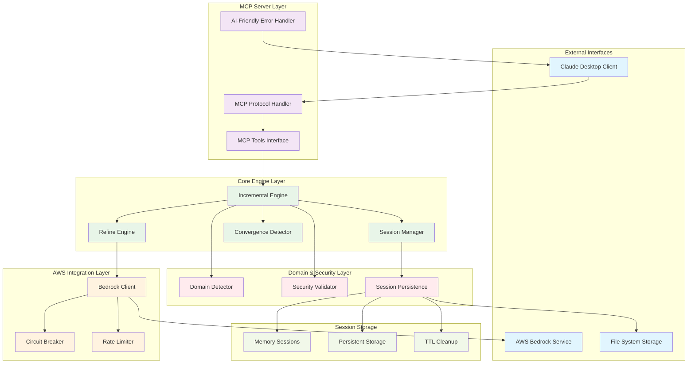
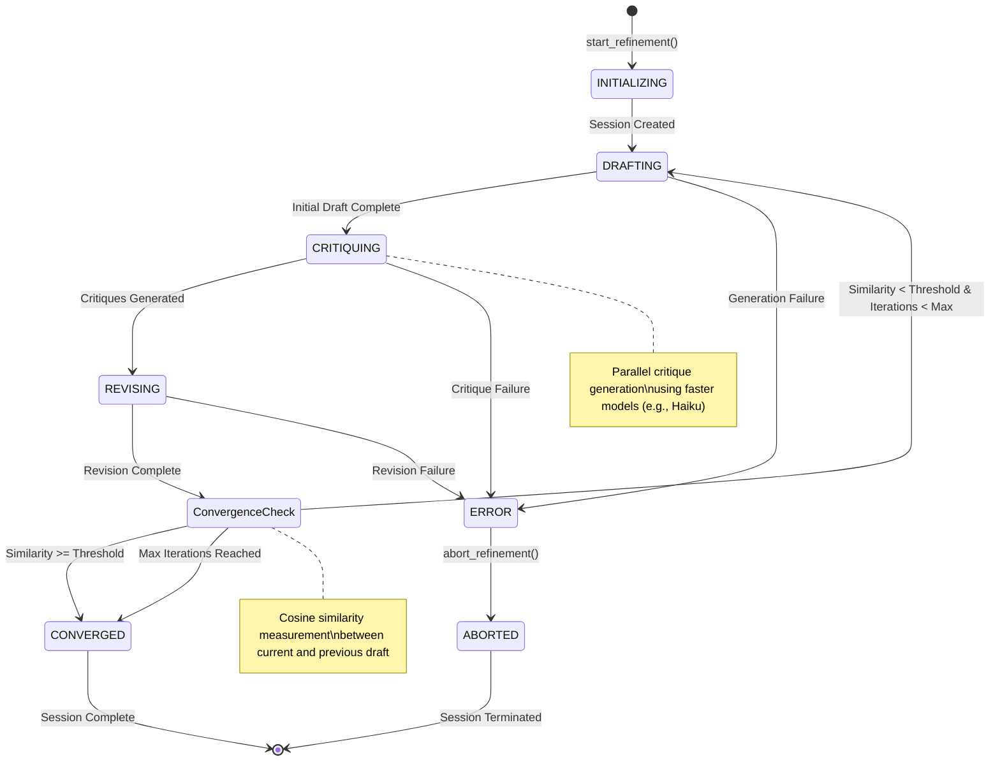
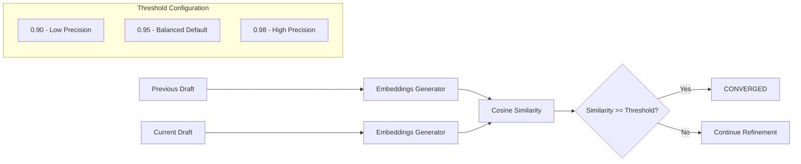
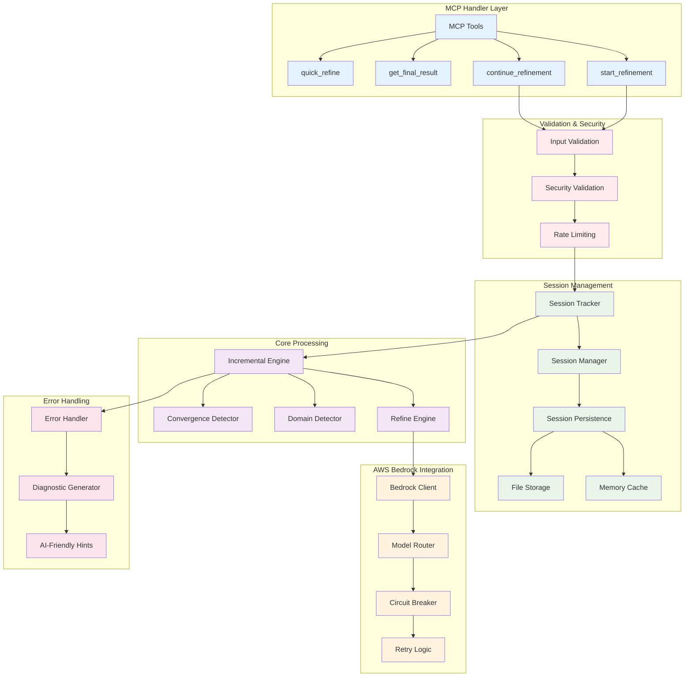
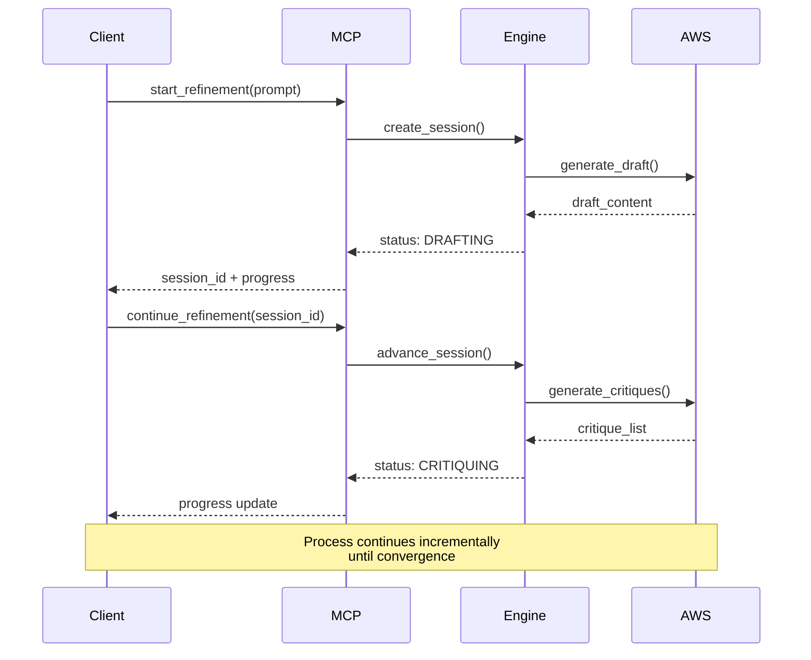
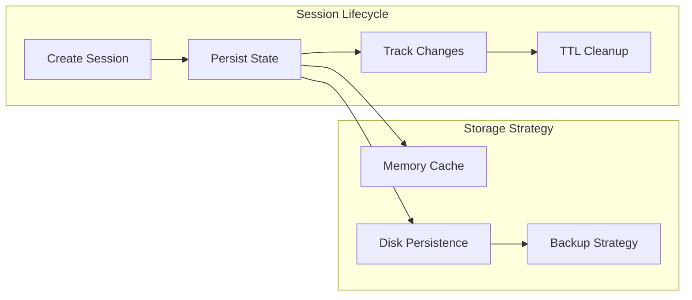
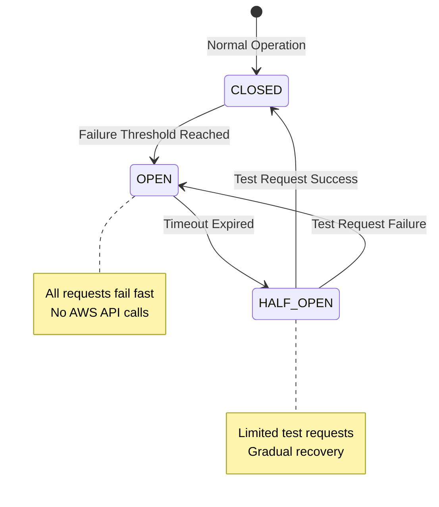
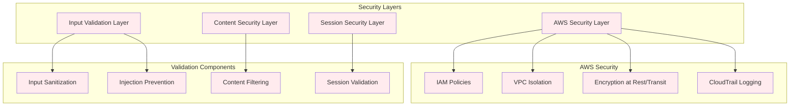
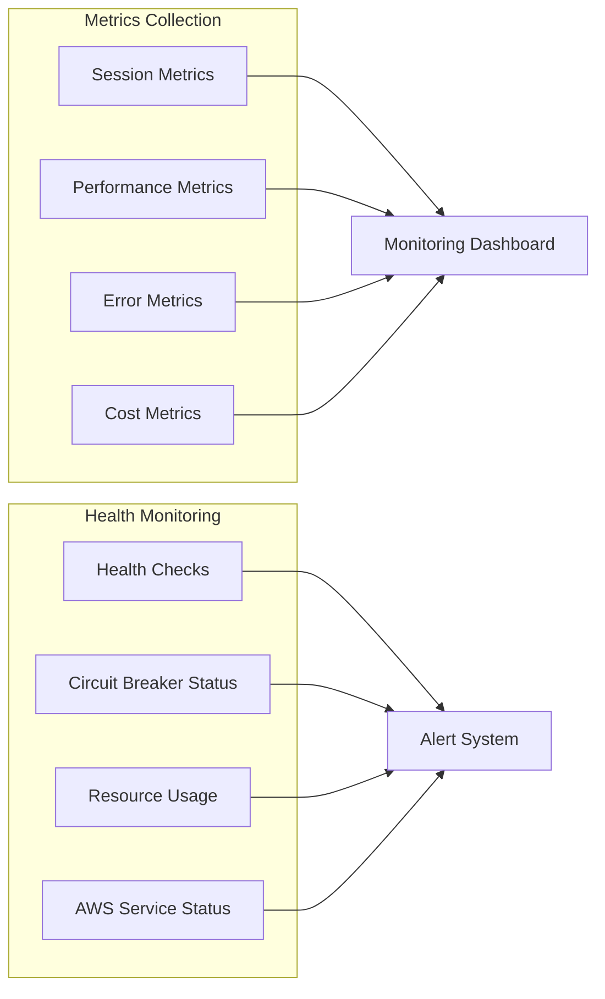

# Recursive Companion MCP - Architecture Documentation

This document provides comprehensive architecture diagrams and explanations for the recursive-companion-mcp system, designed to help new contributors understand the system design and implementation patterns.

## Table of Contents

1. [System Architecture Overview](#system-architecture-overview)
2. [Refinement Process Flow](#refinement-process-flow)
3. [Component Interaction Diagram](#component-interaction-diagram)
4. [Key Architectural Patterns](#key-architectural-patterns)
5. [Security Architecture](#security-architecture)
6. [Performance Considerations](#performance-considerations)

## System Architecture Overview

The recursive-companion-mcp is an MCP (Model Context Protocol) server that implements iterative refinement through self-critique cycles. It's designed as a production-ready cognitive AI system with robust session management, AWS Bedrock integration, and mathematical convergence detection.

### System Components Explanation

**External Interfaces:**
- **Claude Desktop Client**: User interface that communicates via MCP protocol
- **AWS Bedrock Service**: Provides Claude and other LLM models for generation and critique
- **File System Storage**: Persistent storage for session data and configuration

**MCP Server Layer:**
- **MCP Protocol Handler**: Manages MCP communication protocol with Claude Desktop
- **MCP Tools Interface**: Exposes refinement tools (start_refinement, continue_refinement, etc.)
- **AI-Friendly Error Handler**: Provides structured error responses with diagnostic hints for AI assistants

**Core Engine Layer:**
- **Incremental Engine**: Orchestrates the refinement process with incremental steps to avoid timeouts
- **Session Manager**: Manages active sessions with persistence and TTL cleanup
- **Refine Engine**: Implements the core Draft → Critique → Revise logic
- **Convergence Detector**: Uses cosine similarity to measure when refinement is complete

**AWS Integration Layer:**
- **Bedrock Client**: Abstracts AWS Bedrock API interactions
- **Circuit Breaker**: Prevents cascade failures and provides graceful degradation
- **Rate Limiter**: Controls request frequency to respect AWS service limits

**Domain & Security Layer:**
- **Domain Detector**: Auto-detects content domain (technical, marketing, legal, financial) for optimized prompts
- **Security Validator**: Validates inputs and prevents injection attacks
- **Session Persistence**: Manages session serialization and storage

## Refinement Process Flow

The core refinement process follows a **Draft → Critique → Revise → Converge** pattern with incremental execution to prevent timeouts and enable progress visibility.

### Process Flow Explanation

**Session States:**
1. **INITIALIZING**: Session setup with domain detection and configuration
2. **DRAFTING**: Generate initial response or iterate on previous revision
3. **CRITIQUING**: Create multiple parallel critiques from different perspectives
4. **REVISING**: Synthesize critiques into an improved version
5. **CONVERGED**: Mathematical similarity threshold reached or max iterations hit
6. **ERROR**: Recoverable error state with diagnostic information
7. **ABORTED**: User-terminated or unrecoverable error

**Key Process Features:**
- **Incremental Execution**: Each state change returns immediately to prevent timeouts
- **Parallel Critiques**: Multiple critique perspectives generated concurrently for speed
- **Mathematical Convergence**: Uses cosine similarity on embeddings to detect when content stabilizes
- **Domain Optimization**: Auto-detects content type and applies specialized system prompts
- **Progress Visibility**: Real-time status updates for UI integration

**Convergence Detection:**

## Component Interaction Diagram

This diagram shows detailed interactions between core modules, including data flows, security validation, and error handling patterns.

### Component Interaction Details

**Request Flow:**
1. **MCP Tools** receive requests from Claude Desktop
2. **Input Validation** ensures request format and parameter validity
3. **Security Validation** prevents injection attacks and validates content
4. **Rate Limiting** enforces AWS service limits and prevents abuse
5. **Session Tracker** manages session lifecycle and auto-tracking

**Processing Flow:**
1. **Session Manager** handles persistence and retrieval
2. **Incremental Engine** orchestrates refinement steps
3. **Domain Detector** analyzes content and applies specialized prompts
4. **Refine Engine** implements core refinement logic
5. **Convergence Detector** measures similarity using embeddings

**AWS Integration:**
1. **Bedrock Client** manages AWS API interactions
2. **Model Router** selects appropriate models (e.g., Sonnet for generation, Haiku for critiques)
3. **Circuit Breaker** prevents cascade failures
4. **Retry Logic** handles transient failures gracefully

## Key Architectural Patterns

### 1. Incremental Processing Pattern

### 2. Session Management Pattern

### 3. Circuit Breaker Pattern

## Security Architecture

The system implements defense-in-depth security with multiple validation layers:

**Security Features:**
- **Input Sanitization**: Prevents malicious content injection
- **Content Filtering**: Blocks inappropriate or dangerous content
- **Session Validation**: Ensures session integrity and ownership
- **AWS IAM**: Minimal privilege access controls
- **Encryption**: All data encrypted in transit and at rest
- **Audit Logging**: Comprehensive security event logging

## Performance Considerations

### Scalability Patterns

```mermaid
graph TB
    subgraph "Performance Optimizations"
        PC[Parallel Critiques]
        MS[Model Selection]
        CB[Circuit Breakers]
        CA[Caching Strategy]
    end
    
    subgraph "Resource Management"
        SM[Session Memory]
        TTL[TTL Cleanup]
        RL[Rate Limiting]
        RP[Resource Pooling]
    end
    
    subgraph "AWS Optimization"
        MR[Model Routing]
        TO[Timeout Management]
        RR[Request Routing]
        CS[Cost Optimization]
    end
    
    PC --> MS
    MS --> CB
    CB --> CA
    
    SM --> TTL
    TTL --> RL
    RL --> RP
    
    MR --> TO
    TO --> RR
    RR --> CS
```

**Performance Features:**
- **Parallel Processing**: Concurrent critique generation reduces latency
- **Model Selection**: Use faster models (Haiku) for critiques, premium models (Sonnet) for generation
- **Intelligent Caching**: Session state and convergence calculations cached
- **Resource Pooling**: Efficient AWS connection management
- **Timeout Management**: Incremental processing prevents timeouts
- **Cost Optimization**: Smart model routing based on task complexity

### Monitoring and Observability

This architecture documentation provides a comprehensive view of the recursive-companion-mcp system, designed to help contributors understand the sophisticated cognitive AI platform and its production-ready implementation patterns.
